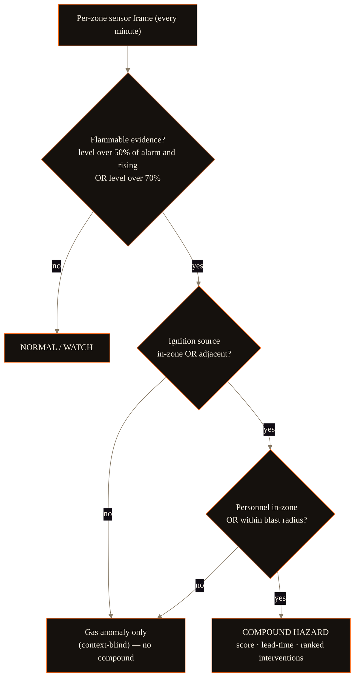
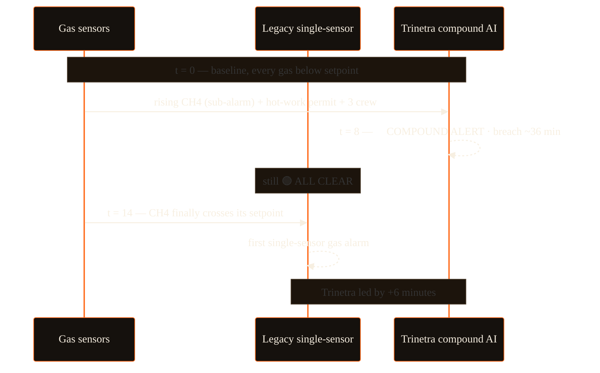
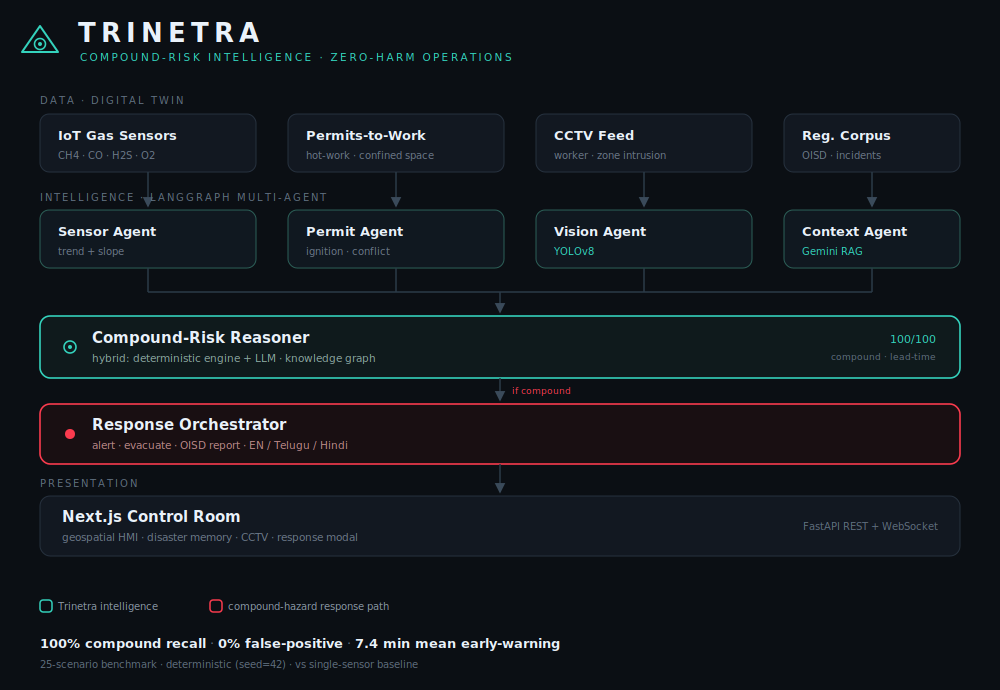
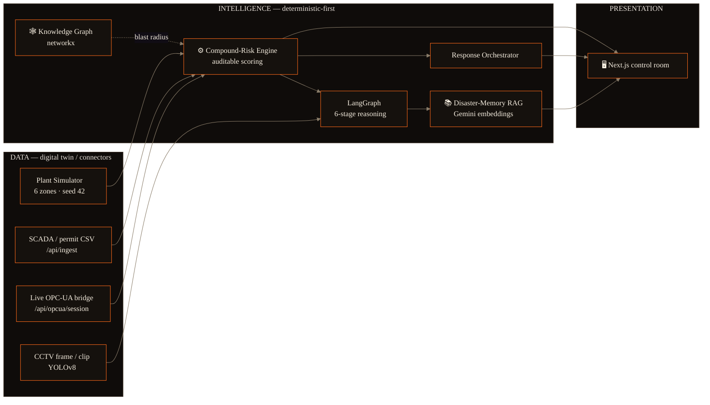
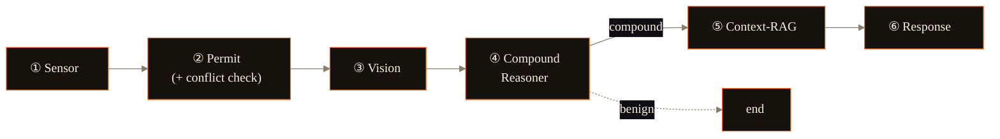
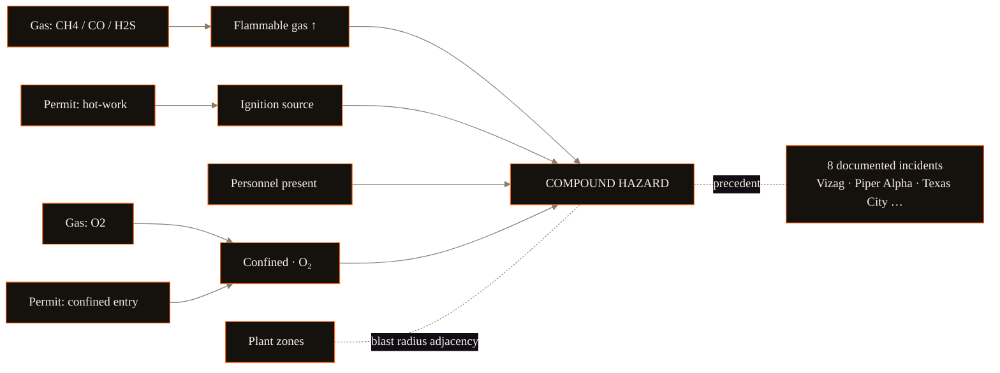
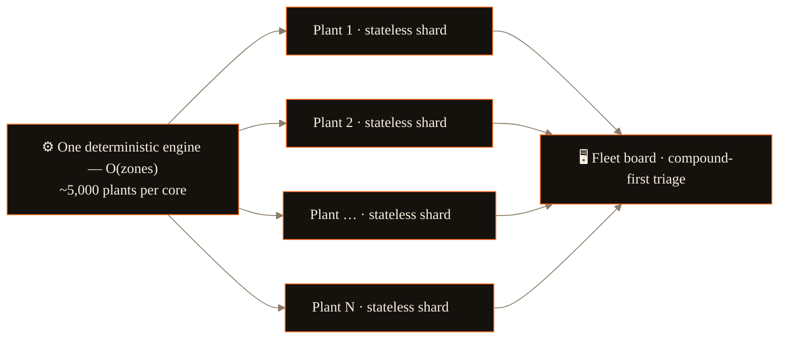
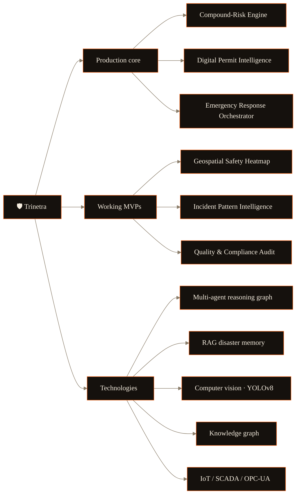
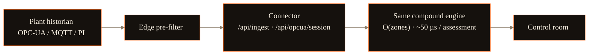

<div align="center">

# 🛡️ TRINETRA

### *the third eye that sees the danger no single sensor can*

**An AI compound-risk intelligence layer for zero-harm industrial operations.**
Trinetra fuses gas sensors, permits, CCTV and shift logs into one real-time brain that catches the **lethal combinations** every individual safety system rates as "normal" — *minutes before they kill.*

<br/>

[](https://github.com/SaudSatopay/trinetra/actions/workflows/ci.yml)


**`100%` compound recall · `0%` false-positive · `7.4 min` mean early-warning**

[**The problem**](#the-8-minutes-that-should-not-have-been-silent) · [**Thesis**](#the-thesis-compound-risk) · [**The moment**](#the-moment-that-wins-the-room-) · [**Architecture**](#architecture) · [**Evidence**](#evidence--how-we-know-it-works) · [**Performance**](#performance--scale) · [**Quickstart**](#quickstart) · [**API**](#api-reference)

</div>

---

<div align="center">

### By the numbers — every figure reproducible (seed 42)

| | | | |
|:---:|:---:|:---:|:---:|
| **100%** compound recall | **0%** false-positive | **+7.4 min** mean lead | **+6 min** at Vizag |
| **~50 µs** p50 frame→alert | **~0.7M** sensor-tags/sec/core | **$0.30** per plant / month | **~5,000** plants / core |
| **30** REST routes + WS | **10/10** fault-mode checks | **5/5** property invariants | **240** held-out scenarios |

</div>

---

## Contents

- [The 8 minutes that should not have been silent](#the-8-minutes-that-should-not-have-been-silent)
- [The thesis: compound risk](#the-thesis-compound-risk)
- [The moment that wins the room](#the-moment-that-wins-the-room-)
- [Architecture](#architecture)
- [The compound-risk engine](#the-compound-risk-engine-the-core-ip)
- [The multi-modal brain](#the-multi-modal-brain)
- [The knowledge graph](#the-knowledge-graph)
- [Evidence — how we know it works](#evidence--how-we-know-it-works)
- [Performance & scale](#performance--scale)
- [Capabilities](#capabilities)
- [Full problem-statement coverage](#full-problem-statement-coverage)
- [The control room](#the-control-room)
- [Deployment — a connector, not a rewrite](#deployment--a-connector-not-a-rewrite)
- [Quickstart](#quickstart)
- [API reference](#api-reference)
- [Project structure](#project-structure)
- [Testing & CI](#testing--ci)
- [Honest caveats](#honest-caveats)

---

## The 8 minutes that should not have been silent

On **13 January 2025, eight workers died** in a coke-oven-battery explosion at the **Visakhapatnam Steel Plant**. The gas sensors had data. The permits were logged. SCADA was running. **No layer connected those signals in time.**

In India's registered factories alone, **about three workers die every day** ([DGFASLI / Ministry of Labour data](https://www.indiaspend.com/special-reports/3-workers-die-every-day-in-indian-factories-govt-data-show-850083)) — and that counts only the organised sector. The bottleneck is not missing sensors. It is the missing **intelligence layer**.

> *"In more than 30 years in gas and heavy industry, the worst incidents were never one single failure. They were usually three or four small things lining up at the same time, each looking acceptable on its own. Most of the time, nothing actually flagged that combination before it became a serious event — that's where experience, communication, and a strong safety culture make the difference."*
>
> — **Nishat Mulla**, Plant Manager · 30+ years across gas & heavy industry *(field validation of the problem — an industry veteran, in his own words)*

**That unflagged combination is the gap Trinetra closes.** It encodes that veteran judgment and watches every zone 24/7 — so the catch never depends on the right person paying attention at 3 a.m.

## The thesis: compound risk

Fatalities are rarely one sensor screaming. They are a **combination** that each looks normal:

```
   rising (but sub-alarm) flammable gas
 + an active hot-work permit  (ignition source)
 + personnel inside a confined space
 ─────────────────────────────────────────────
 = a lethal combination NO single sensor flags
```

**Three green lights. One lethal combination.** Trinetra detects it — and acts — *before* the alarm. The decision is made by a transparent, deterministic engine; the LLM never makes the life-safety call.



## The moment that wins the room 🎯

While the incident develops, the two systems live in **split realities**:

| | LEGACY single-sensor | TRINETRA compound AI |
|---|---|---|
| **t = 8 min** | 🟢 **ALL CLEAR** — every gas below its setpoint | 🔴 **COMPOUND ALERT** — COB-1 critical · breach predicted · evacuate now |
| **t = 14 min** | 🔴 first gas alarm (CH4) | (screaming for 6 minutes already) |

**+6 minutes of early warning** — while every gas sensor still reads below its setpoint. Six minutes is the window an operator gets to suspend the permit and clear the floor before ignition.



---

## Architecture

A **hybrid** brain across three layers: a digital-twin (or live-connector) **data** layer, a deterministic-first **intelligence** layer, and a real-time control-room **presentation** layer.





> **Why hybrid?** Industry juries (rightly) distrust a language model making a life-safety call. So the **decision** is a transparent, reproducible score with explicit thresholds; Gemini only *explains* the decision, *retrieves* historical precedent, and *drafts* the report. If the model is down, the safety call is unaffected.

---

## The compound-risk engine (the core IP)

[`backend/app/engine/compound.py`](backend/app/engine/compound.py) — a deterministic, baseline-subtracted scorer where **context multiplies the gas signal**:

```
score = 100 · raw · (1 + ignition + personnel + confined)

  raw       = Wₗ·(flammable level − background) + Wₛ·(projected rise) + Wₜ·toxic + W₂·O₂-deficit
  ignition  = 0.8 in-zone · 0.4 adjacent  (blast radius)
  personnel = 0.5 if anyone is in the blast radius
  confined  = 0.6 · O₂-deficit in a confined space
```

What makes it more than a threshold dashboard:

- **Baseline-subtracted** — a coke oven's normal background gas never manufactures risk.
- **Predictive** — extrapolates the trend to a **time-to-threshold** ("breach in ~36 min"), so it's anticipatory, not reactive.
- **Prescriptive** — ranks the single most effective intervention by *counterfactual* risk reduction ("suspend hot-work permit → −85%"), computed on the uncapped score.
- **Cross-zone blast-radius** — both ignition *and* personnel exposure propagate to adjacent zones, so "gas here, the crew next door" is still a compound hazard.
- **Calibrated confidence** — a 128-draw Monte-Carlo over the per-sensor noise model reports how robust the verdict is ("alert confidence 92%, breach ~36 ± 3 min").

Everything is deterministic given the simulator seed, so every number below is reproducible.

## The multi-modal brain

| | Capability | Endpoint |
|---|---|---|
| ⚙️ | **Compound engine** — catches danger *below* single-sensor thresholds | `100% recall · 0% FP` |
| 👁️ | **Computer vision** — YOLOv8 person + restricted-zone-intrusion (single frame + a looping recorded feed) | `/api/vision · /api/vision/feed` |
| 🤖 | **Reasoning graph** — LangGraph **6-stage auditable trace** (deterministic stages) | `/api/agents` |
| 📚 | **Disaster memory (RAG)** — matches live conditions to real disasters via Gemini embeddings | `81% Vizag match` |
| 🚨 | **Autonomous response** — OISD/Factory-Act incident report + **EN/Telugu/Hindi** alerts | `/api/response` |

…plus **predictive time-to-threshold**, **prescriptive interventions**, **cross-zone blast-radius reasoning**, **pre-mortem hazard discovery**, and a **knowledge graph**.

The reasoning graph is a **compiled LangGraph `StateGraph`** with a full auditable trace — deterministic feature-extraction stages, *not* autonomous LLM agents (by design, so the life-safety path is reproducible):



## The knowledge graph

The domain safety-knowledge is encoded as a real graph ([`backend/app/kg/graph.py`](backend/app/kg/graph.py), networkx) — **27 nodes / 36 edges** — and rendered **live in the control room** (toggle *Knowledge graph →* on the plant panel). It also powers blast-radius reachability.



---

## Evidence — how we know it works

> The full methodology and every table live in **[docs/BACKTEST.md](docs/BACKTEST.md)**. All numbers are reproducible (fixed seed 42).

### Benchmark — 29 labelled scenarios

| Metric | Trinetra |
|---|---|
| Compound-hazard detection **recall** | **100%** (14 / 14) |
| **False-positive** rate (15 hard negatives, incl. inerted + O2 dropout) | **0%** |
| Mean **early-warning** over single-sensor | **7.4 min** (median 6, max 12) |

### Ablation — is the full fusion necessary?

| Detector tier | Recall | False-alarm | Precision | Lead |
|---|---|---|---|---|
| Single-sensor threshold (incumbent) | 100% | 73% | 56% | 0 min |
| Gas-trend rule (**no context**) | 100% | 67% | 58% | 7.4 min |
| **Trinetra (full compound fusion)** | 100% | **0%** | **100%** | **7.4 min** |

Context is what turns *early* detection into *actionable* early detection (67% → 0% false alarms at the same lead).

### Generalization — held-out, unseen seeds

**240 randomized scenarios** (120 hazards + 120 decoys) at seeds the thresholds were never tuned on → **100% recall, 3.3% false-positive** (96.8% precision, 7.7 min lead). Not overfit to the curated 29.

### Real-incident replay — reconstructed from two real inquiries

Reconstructed from **two** real inquiries and replayed through the *same* engine, no tuning. **U.S. CSB BP Texas City (2005):** the compound alert fires at **T+10 — ten minutes before the vapour-cloud ignition the CSB documented at T+20** (7 before any single sensor). **MB Lal Jaipur (2009):** **T+12 — 36 minutes before** the documented ignition of a long, undetected vapour build-up. *Honest mapping* — neither site had a working gas detector (a finding in both inquiries), so the documented vapour escalation is mapped onto the flammable channel; the ignition timing and the personnel are the inquiry's. *(In-app: connector → **Texas City · CSB '05** / **Jaipur · MB Lal '09**.)*

### External-data replay — real measured data the engine never authored

The held-out generalization run answers "train = test" *inside* the simulator; this answers it **outside** it. We replay a **real, peer-reviewed, third-party measurement** — hourly CO from the **UCI #360 Air Quality** dataset (De Vito et al., 2008; DOI 10.24432/C5K603, CC BY 4.0) — through the **same connector and the same untuned engine**. On that real, dip-laden CO build-up the compound alert fires at **T+3** — and the engine **tracks the real signal**: it relaxes during the dataset's genuine CO dips (no crying wolf) and stands down when the CO clears overnight. The early **detection is scale-robust** (T+2–4 across every y-scale); the lead in minutes is measured against the single-sensor baseline and *is* scale-sensitive, so rather than quote one number we publish the full **lead-vs-scale sweep** (`lead_by_scale`; +10 at our disclosed ×6). What is real (the CO **dynamics**) vs overlaid (the y-scale + a hot-work/personnel context) — and the honest scale correction — is spelled out in **[docs/EXTERNAL_DATA.md](docs/EXTERNAL_DATA.md)**. *(In-app: connector → **Air Quality · De Vito '08**.)*

A **second** external exhibit comes from a *recognized third-party physics model* rather than a measurement: **EPA/NOAA ALOHA** (the CAMEO dispersion tool). A modeled methane release runs through the **same connector + untuned engine**, and because methane → %LEL is fixed chemistry (`%LEL = ppm ÷ 500`) **the y-scale multiplier is eliminated** — De Vito's one soft spot — leaving the **receptor distance** as the only chosen parameter, which is **disclosed and swept**, not hidden. It lands the **blind-spot axis**: at a realistic 100 m crew standoff EPA's physics put a *sustained ~8.2 %LEL* cloud where a single 10 %LEL detector reads **green for the entire release**, yet Trinetra (sub-threshold gas + hot-work permit + crew) flags **compound at T+1 and holds it**. A **live-computed distance sweep** (`distance_sweep` in the endpoint; 50 / 100 / 150 m committed curves) shows it isn't cherry-picked — dense enough to alarm even a single sensor at 50 m, correctly **silent** at 150 m. Full provenance (ALOHA 5.4.7 + every parameter) and the real-vs-overlaid split are in **[docs/EXTERNAL_DATA.md](docs/EXTERNAL_DATA.md)**. *(In-app: connector → **Methane · EPA ALOHA**.)*

### Engine invariants — property-tested

Beyond the labelled scenarios, **5 engine invariants are property-tested with Hypothesis** (`test_invariants.py`) across thousands of generated inputs — level is monotonic in score, the score stays bounded, a compound alert always carries an intervention, a suspect O2 reading can never *silence* an explosion, and protected inerting stays zone-local. **5/5 hold.**

---

## Performance & scale

Real-time on commodity hardware, and the unit economics fall with the fleet. Both are **measured, not asserted** — re-run `python throughput.py` and `GET /api/fleet/scale`.

### Latency — frame → alert, single core, no GPU

| | p50 | p90 | p99 | p99.9 |
|---|---|---|---|---|
| **frame → alert** | **~50 µs** | ~62 µs | ~90 µs | ~150 µs |

≈ **0.7M sensor-tags/sec** on one core (≈117k zone-assessments/sec). A 10,000-tag plant assesses in **~14 ms per 1 Hz frame — ≈70× real-time**, no GPU in the life-safety path. *(Representative single-core run; `throughput.py` is a noisy micro-benchmark — figures land in this band.)*

### Fleet economics — one engine, every plant

The engine is `O(zones)` and **stateless per plant** — no shared state, no per-site model — so the fleet scales horizontally by adding plain workers. `GET /api/fleet/scale` *times* the engine live and derives the cost curve:



| Plants | Cores | Cost / month | **$ / plant / month** |
|---|---|---|---|
| 10 | 1 | $30 | **$3.00** |
| 100 | 1 | $30 | **$0.30** |
| 1,000 | 1 | $30 | **$0.03** |
| 10,000 | 2–3 | $60–90 | **< $0.01** |

*Basis: a `$30/core-month` cloud vCPU, provisioned at a conservative 4× headroom over measured capacity (leaving room for the co-located per-request CPU — (de)serialization, GC, bursts). Risk-compute only; ingest/storage/networking scale separately. Digital-twin sites stand in for live OPC-UA / MQTT feeds — ingesting real data is a connector, not a rewrite.*

---

## Capabilities

| | | |
|---|---|---|
| 📊 **Ablation proof** | context fusion vs naive tiers — 67% → 0% false alarms | `python ablation.py` |
| 🎲 **Generalization** | 240 held-out randomized scenarios → 100% recall / 3.3% FP | `python test_generalization.py` |
| 🧯 **Real-incident replay** | CSB Texas City (2005) → fires 10 min before the documented ignition | `/api/incident/texas-city` |
| 🛰️ **External-data replay** | real measured CO (UCI #360, De Vito 2008) through the same untuned engine — the answer to "you authored the data" | `/api/external/air-quality` |
| 🧪 **Modeled-physics replay** | EPA ALOHA methane dispersion, fixed ppm→%LEL (no y-scale; receptor distance disclosed + swept) — single sensor blind at 8.2 %LEL while compound fires | `/api/external/aloha-methane` |
| 🔮 **Pre-mortem discovery** | searches the plant for lethal combinations that *haven't happened yet* | `/api/premortem` |
| 🏭 **Fleet command** | the same engine across a fleet of plants on one board — the scalability story made concrete | `/api/fleet` |
| 💵 **Measured scale economics** | times the engine live → plants-per-core + a $/plant/month cost curve | `/api/fleet/scale` |
| 🔌 **Live OPC-UA ingest** | rebuilds gas readings off an OPC-UA wire and scores them through the same engine — real-protocol, not a file | `/api/opcua/session` |
| 🚫 **Shift-left permit gate** | refuses a permit that would *create* a compound hazard — prevention at the permit desk, not detection after | `/api/permit-gate` |
| 🔁 **Active-learning flywheel** | per-plant nuisance tuning from operator feedback, with a hard recall guardrail (compound always pages) | `/api/feedback` |
| 💰 **Business impact** | EV-adjusted ROI — **₹115.5 Cr** per prevented incident, **~7.7× expected annual return** (1-in-15-yr) + insurance offset | response modal |
| 🎛️ **Scenario editor** | toggle gas / ignition / personnel / blast-radius and watch the engine flip live | `/api/simulate` |
| 🔗 **SCADA connector** | replay a real SCADA/permit CSV through the same engine — *a connector, not a rewrite* | `/api/ingest` |
| 📚 **Pattern intelligence** | mines recurring causal patterns across a near-miss + incident corpus | `/api/patterns` |
| ✅ **Compliance & audit** | live OISD / DGMS / Factory-Act audit — per-zone deviations + corrective actions | `/api/compliance` |
| 🛟 **Demo-safe** | cached/golden fallbacks keep the room functional if the LLM is rate-limited; **Judge Mode** jumps to the money shot | `TRINETRA_DEMO_MODE=1` |

## Full problem-statement coverage

All six illustrative builds — three as the production core, three as focused working MVPs — across every suggested technology:



## The control room

A bespoke, instrument-grade HMI (Next.js 14 + a "foundry" design system — warm ink, a molten-orange signature, and a risk ramp that visibly *heats up*):

- **Geospatial plant schematic** — a continuous risk heat-field, flowing blast-radius links, worker-location markers, a 270° risk gauge.
- **Plant / Fleet / Knowledge toggle** — the geospatial plant, the multi-plant fleet board, or the reasoning graph, in the main panel.
- **Fleet command** — one engine across many plants, ranked compound-first, with the live aggregate (plants · workers · compound now · exposed · max lead) and the measured cost curve.
- **Threat panel** — score, level, projected breach (± confidence), the "why" factors, the ranked prescriptive intervention.
- **Split-reality readout** — *Legacy: all clear* vs *Trinetra: compound alert · +N min*.
- **Disaster-memory card**, **CCTV/YOLOv8 tile**, **scenario editor**, **SCADA connector**, **Safety-Intelligence chips** (compliance · patterns · pre-mortem · **permit gate** · **learning** · reasoning), and an auto-popping **autonomous-response modal**.
- **Judge Mode** — one click resets to the Vizag hero, 4×, and jumps to the money shot.
- **Booth / attract mode** — an unattended ~60-second kiosk loop (Vizag → Texas City → fleet → cross-zone → a silent hard negative) that sounds a siren and a spoken evacuation on every compound hazard; one click to start, with a mute toggle.

## Deployment — a connector, not a rewrite

The digital twin and a real plant feed are the *same* interface — the engine cannot tell the difference. A live **OPC-UA bridge** (`/api/opcua/session`) and the **CSV connector** (`/api/ingest`) already prove it: real plant data enters the *same* engine through a connector, not a rewrite.



The **fleet view** (`/api/fleet`) runs that same engine across many plants on one board: no per-site retraining, horizontally shardable, with live unit economics at `/api/fleet/scale`.

---

## Quickstart

**One command** (Windows) — starts both servers and opens the control room:

```powershell
powershell -ExecutionPolicy Bypass -File scripts/demo.ps1
```

…or run them manually:

**Backend** (Python 3.10+)
```bash
cd backend
python -m venv .venv && .venv/Scripts/activate      # (Unix: source .venv/bin/activate)
pip install -r requirements.txt
# optional: put a key in backend/.env  ->  GEMINI_API_KEY=...   (without it, the AI layer serves vetted cached analysis)
python -m uvicorn app.api.server:app --app-dir .    # http://127.0.0.1:8000
```

**Frontend** (Node 18+)
```bash
cd frontend
npm install
npm run dev                                          # http://localhost:3000
```

Open **http://localhost:3000**, let the `vizag` scenario play to ~t8, and watch COB-1 ignite while the legacy side stays "All clear." For a bulletproof demo, set `TRINETRA_DEMO_MODE=1` (instant cached AI; embeddings stay live).

**Zero-install core** — the engine + benchmarks are pure standard library (no pip needed):
```bash
cd backend
python run_engine.py --scenario vizag      # engine vs single-sensor, live in the terminal
python benchmark.py                         # the headline metrics
```

## API reference

FastAPI service — **30 REST routes + a WebSocket stream** (the stream endpoint exists for push deployments; the demo control room replays precomputed frames so the timeline is scrubbable). Base: `http://127.0.0.1:8000`. *(Responses are UTF-8 JSON; some engine factor strings use en/em-dashes — view in a browser or a UTF-8 terminal, not a legacy cp1252 console, to avoid mojibake.)*

| Route | Purpose |
|---|---|
| `GET /api/health` | service status |
| `GET /api/scenarios` | available scenarios (hero, decoys, cross-zone) |
| `GET /api/plant` | static plant geometry + gas thresholds |
| `GET /api/frames/{scenario}` | full precomputed run (the dashboard scrubs this) |
| `WS  /ws` | live frame stream at a chosen speed |
| `GET /api/simulate` | ad-hoc scenario from the editor's toggles |
| `GET /api/ingest/sample` · `POST /api/ingest` | download / replay a SCADA-permit CSV |
| `GET /api/opcua/session` | live OPC-UA bridge — reads gas tags off the wire and scores them |
| `GET /api/incident/texas-city` · `…/texas-city.csv` | the CSB Texas City reconstruction + raw feed |
| `GET /api/incident/jaipur` · `…/jaipur.csv` | the MB Lal Jaipur reconstruction + raw feed |
| `GET /api/external/air-quality` · `…/air-quality.csv` | real measured CO (UCI #360, De Vito 2008) replayed + raw feed |
| `GET /api/external/aloha-methane` · `…/aloha-methane.csv` | EPA ALOHA methane dispersion replayed (fixed ppm→%LEL, live `distance_sweep`) + raw feed |
| `GET /api/agents` | the 6-stage reasoning trace |
| `GET /api/disaster-memory` | closest historical precedent + grounded briefing |
| `GET /api/vision` · `/api/vision/feed` | YOLOv8 person / zone-intrusion — single frame + a looping recorded feed |
| `GET /api/response` | autonomous response: actions, report, multilingual alerts, impact |
| `GET /api/knowledge-graph` | the networkx knowledge graph (nodes + edges) |
| `GET /api/patterns` | incident-pattern intelligence |
| `GET /api/compliance` | live OISD / DGMS / Factory-Act audit |
| `GET /api/ablation` | the three-tier ablation study |
| `GET /api/premortem` | pre-mortem hazard discovery |
| `GET /api/fleet` · `/api/fleet/scale` | multi-plant fleet rollup + measured plants-per-core / cost curve |
| `GET /api/permit-gate` | shift-left permit gate — block / conditional / clear verdict |
| `GET/POST /api/feedback` · `POST /api/feedback/reset` | operator-feedback flywheel — per-plant nuisance tuning |

## Project structure

```
trinetra/
├── backend/
│   ├── app/
│   │   ├── engine/compound.py   # ⚙️ the compound-risk engine (core IP)
│   │   ├── simulator.py         # the 6-zone digital twin
│   │   ├── scenarios.py         # hero + decoys + cross-zone scenarios
│   │   ├── constants.py         # zones, gas thresholds, sensor-noise model
│   │   ├── domain.py            # dataclasses + enums
│   │   ├── agents/graph.py      # 🤖 LangGraph 6-stage reasoning graph
│   │   ├── ai/                  # Gemini client · disaster-memory RAG · incident reports · patterns · golden fallbacks
│   │   ├── kg/graph.py          # 🕸️ networkx knowledge graph
│   │   ├── vision/detector.py   # 👁️ YOLOv8 detector (frame + recorded feed)
│   │   ├── impact.py            # 💰 EV-adjusted ROI model
│   │   ├── compliance.py        # ✅ OISD/DGMS/Factory-Act audit
│   │   ├── premortem.py         # 🔮 pre-mortem hazard discovery
│   │   ├── fleet.py             # 🏭 multi-plant rollup + measured scale economics
│   │   ├── opcua_bridge.py      # 🔌 live OPC-UA ingest
│   │   ├── permit_gate.py       # 🚫 shift-left permit-issuance gate
│   │   ├── feedback.py          # 🔁 operator-feedback / active-learning flywheel
│   │   ├── replay.py            # 🔗 SCADA / real-incident CSV connector
│   │   └── api/                 # FastAPI service + serialization
│   ├── benchmark.py · ablation.py · test_robustness.py · test_generalization.py
│   ├── test_invariants.py · throughput.py · smoke_api.py
├── frontend/                    # Next.js 14 control room (app/ · components/ · lib/)
├── docs/                        # architecture.svg · BACKTEST.md · EXTERNAL_DATA.md · deck · DEMO_SCRIPT.md
└── scripts/demo.ps1             # one-command launcher
```

## Testing & CI

GitHub Actions runs the full suite on every push (badge above):

```bash
cd backend
python benchmark.py            # 100% recall / 0% FP / 7.4 min
python ablation.py             # 67% → 0% false alarms
python test_robustness.py      # 10 sensor/permit fault modes
python test_generalization.py  # 240 held-out scenarios
python test_invariants.py      # 5 property-based engine invariants (Hypothesis)
python throughput.py           # frame→alert latency percentiles + tags/sec
python smoke_api.py            # REST + WebSocket smoke
```

## Honest caveats

- The demo runs on a **digital twin**, not a live plant — by necessity in a build sprint. It ingests standard SCADA/IoT/permit formats, so real-plant data enters the *same* engine through the `/api/ingest` and `/api/opcua/session` connectors — proven by the Texas City / Jaipur replays and, most directly, by replaying a **real third-party measured dataset** (UCI #360 CO, De Vito 2008) and a **recognized third-party physics model** (EPA ALOHA methane dispersion, fixed ppm→%LEL) the engine never authored; see [docs/EXTERNAL_DATA.md](docs/EXTERNAL_DATA.md).
- The 29 benchmark scenarios were authored by us, but include **hard negatives** the engine must reject — among them inerted zones where all three explosion factors are present yet it is safe, and a single-sample O2-sensor dropout that must not fabricate an asphyxiation alert — and the engine also catches the **asphyxiation** hazard a flammable-only system misses. The held-out generalization run (240 unseen-seed scenarios), **two reconstructed real incidents** (CSB Texas City, MB Lal Jaipur), and the **property-tested invariants** address the "train = test" critique.
- The headline metrics are measured on the **compound flag** (the lethal pattern), distinct from ordinary gas alarms — the value is the *combination* and the *lead time*.
- The reasoning "agents" are **deterministic feature-extraction stages**, not autonomous LLM agents — a strength for a reproducible life-safety path.
- Three of the six builds (geospatial, pattern-mining, compliance) are **focused MVPs**; the compound engine, permit intelligence and response orchestrator are the production core.

---

<div align="center"><br><sub>Built for the <b>ET AI Hackathon 2.0</b> · Problem Statement #1 — AI-Powered Industrial Safety Intelligence · <a href="LICENSE">MIT</a></sub></div>
